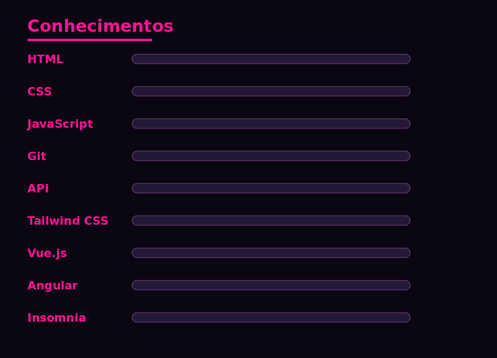
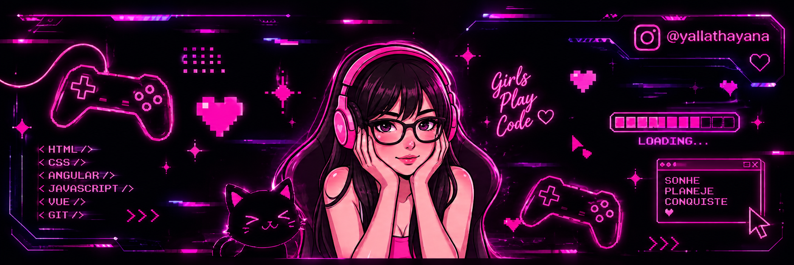

<p align="center">
  
</p>

<br>


<br>

<!-- LINHA NEON -->


</div>

<br>

<!-- ========================================================= -->

<!--                         ABOUT                             -->

<!-- ========================================================= -->

## Sobre mim

<div align="center">


</div>

<br>

<div align="center">

|       Área      |              Conhecimento              |
| :-------------: | :------------------------------------: |
|     Formação    |         Engenharia de Software         |
|       Foco      |                Front-End               |
| Desenvolvimento |                   Web                  |
|    Interesse    |                  UI/UX                 |
|     Objetivo    | Evoluir em desenvolvimento de software |

</div>

<br>

<div align="center">


</div>

<br>

<!-- ========================================================= -->

<!--                       TECHNOLOGIES                        -->

<!-- ========================================================= -->

## Tecnologias

<div align="center">


<br>

<p align="center">
  
  &nbsp;&nbsp;&nbsp;
  
</p>
</div>

<br>

<div align="center">


</div>

<br>

<div align="center">


</div>

<br>

<!-- ========================================================= -->

<!--                      KNOWLEDGE                           -->

<!-- ========================================================= -->

<p align="center">
  
</p>
<br>

<div align="center">


</div>

<br>

<!-- ========================================================= -->

<!--                         CODE                              -->

<!-- ========================================================= -->

## Perfil

```javascript
const yalla = {
    nome: "Yalla Thayana",
    area: "Engenharia de Software",
    foco: "Front-End",

    conhecimentos: [
        "HTML",
        "CSS",
        "JavaScript",
        "API",
        "Git",
        "Tailwind CSS",
        "Vue.js",
        "Angular",
        "Insomnia"
    ],

    interesses: [
        "Desenvolvimento Web",
        "UI/UX",
        "Tecnologia"
    ],

    objetivo: "Evoluir constantemente em desenvolvimento de software"
};
```

<br>

<div align="center">


</div>

<br>

<!-- ========================================================= -->

<!--                    CURRENTLY LEARNING                    -->

<!-- ========================================================= -->

## Atualmente

<div align="center">


</div>

<br>

<div align="center">


</div>

<br>

<!-- ========================================================= -->

<!--                         PROJECTS                          -->

<!-- ========================================================= -->

## Projetos

<div align="center">


<br>

<a href="https://github.com/coffetobug">


</a>

</div>

<br>

<div align="center">


</div>

<br>

<!-- ========================================================= -->

<!--                         SOCIAL                            -->

<!-- ========================================================= -->
## Contato

<div align="center">

<a href="https://github.com/coffetobug">
  
</a>
&nbsp;&nbsp;&nbsp;
<a href="https://instagram.com/yallathayana">
  
</a>
&nbsp;&nbsp;&nbsp;
<a href="https://discord.com/users/yalla.thayana">
  
</a>

</div>

<br>


</div>

<br>

<div align="center">


</div>

<br>

<!-- ========================================================= -->

<!--                       GITHUB STATS                       -->

<!-- ========================================================= -->

## GitHub Stats

<div align="center">


</div>


<br>

<div align="center">


</div>

<br>

<!-- ========================================================= -->

<!--                     ACTIVITY                             -->

<!-- ========================================================= -->

## Atividade

<div align="center">


</div>

<br>

<!-- ========================================================= -->

<!--                         FOOTER                           -->

<!-- ========================================================= -->

<div align="center">


<br>
<p align="center">
  
</p>
</div>
